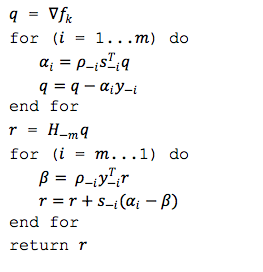

# Convex Optimisation in Spark Logistic Regression

[breeze](https://github.com/scalanlp/breeze) provides the convex optimisation methods for Spark. 

When regParamL1 == 0, spark LR uses BreezeLBFGS, which implements [L-BFGS](https://en.wikipedia.org/wiki/Limited-memory_BFGS) algorithm, otherwise, BreezeOWLQN is applied, which implements [OWLQN](http://research.microsoft.com/en-us/um/people/jfgao/paper/icml07scalable.pdf).

I am going to explain my understanding about those optimisation algorithms. and then I will show how they are intergrated inside spark LR.  

Define the objective function as: $ f(x): R^n \rightarrow R $, and is convex and 2nd order differentiable.

# [gradient descent](https://en.wikipedia.org/wiki/Gradient_descent)
The gradient shows the fastest decrease direction for the function $f$. So we can always update x as:

$ x_{k+1} = x_k - \lambda  \nabla f$

(I will talk about the step length $\lambda$ in next article.)

# [Newton's Method](https://en.wikipedia.org/wiki/Newton%27s_method)
If $f$ is convex and differentiable, at the mininal value point x, it must be $ \nabla f(x) = 0$. So the problem changes to solving this equation. We write the Taylor expansion around $x_k$:

$f(x) = f(x_k)+ \nabla f(x_k) (x- x_k) + \frac{1}{2} (x-x_k)^T H(x_k) (x-x_k)$

(1)

taking the derivative of the above function:

$\nabla f(x) =\nabla f(x_k) + H(x_k)(x-x_k) = 0$

(2)

solving it we can get:

$x=x_k - H(x_k)^{-1} \nabla f(x_k)$

(3)

## Algorithm:

1. get the analytical form of gradient and hessian matrix of $f$
2. initial $x_0$, set $k=0$
3. calculate $g_k = \nabla f(x_k)$, if $||g_k|| \leq \varepsilon_1$, return $x = x_k$
4. calculate $H_x = H(x_k)$ and its inverse $H_k^{-1}$
5. calculate $p_k$ from  $p_k = -H_k^{-1}g_k$
6. linear search for step length $\lambda$:  $ argmin _ \lambda f(x_k + \lambda p_k) $
7. update $x_{k+1} = x_k + \lambda p_k, k = k + 1$; 
8. if $|| f(x_{k+1}) - f(x_k)|| \leq \varepsilon_2$, return $x = x_{k+1}$, else goto step 3

 
##properties of Hessian matrix

Even we can get the analytical form of the inverse of Hession matrix, we have to apply n^2 function evaluation. For LR, every function evaluation should involve all the training data. So it is impossible to directly use the Newton's method.

### hessian matrix is [positive definite](https://en.wikipedia.org/wiki/Positive-definite_matrix)

when (3) is applied to update $x$, funciont $f$ always decreases, If the hessian matrix is positive definite.

if we substitue x with (3), into (1), and ignore second order item, we can get:

$ f(x) = f_k - g_k^T * H_k^{-1} * g_k$

then we get the result: if the hessian matrix is positive definite, which means $  g_k^T * H_k^{-1} * g_k > 0 $, then f(x) will go the descent direction.

### [Secant Condition](https://en.wikipedia.org/wiki/Secant_method)
From (2), it is easy to get $ g_{k+1} - g_k = H_k * (x_{k+1} - x_k)$

**SYMBOL**: $ s_k= x_{k+1} - x_k; y_k=g_{k+1} - g_k;  $

so the quasi-Newton condition is defined as:

$ y_k = s_k H_k$

(4)
or

$ H_k^{-1}  y_k = s_k$

(5)

# Quasi-Newton method
Subject to the most 2 important properties of Hessian matrix, we can find something to approximate it. The key point is to calculate it *iteratively*.

## DFP
it gives a iterative method to calculate Hessian matrix.

$H_{k+1} = U_k^TH_kU_k + \rho_ky_ky_k^T$

where $\rho_k = \frac{1}{y_k^T s_K}$, and $U_k=I-\rho_k y_k y_k^T$

## BFGS
it gives a iterative method to calculate the **inverse** of Hessian matrix. And the theory is so beautiful that it is symmetric between DFP and BFGS: they are identical except that y and s have been reversed.

NOTE: we are still using the symbol $H$, but it represents the inverse of Hessian matrix.

$H_{k+1} = V_k^T H_k V_k + \rho_k s_k s_k^T$

(6)

where $V_k = I - \rho_k s_k s_k^T$, and $\rho_k$ is still the inverse of the dot product of $s_k$ and $y_k$

##L-BFGS
DFP and BFGS need store the matrix of previous iteration, it cost $\frac{1}{2} n*(n+1)$ storage since the matrix is symmetric. It became huge when n continuely increases.

L-BFGS approximates it using the previous $m$ iteration's $s$ and $y$, so that the storage could be reduced to m*n. 

But the most beautiful part of L-BFGS is that the $H_k^{-1}g_k$ is computed  as a whole. The algorithm is designed by GENIUS . 

It is quiet simple to expand formula (6), using $H_{k-1}$ to represents $H_k$, and so on:

$ H_K = (V_{-1}^TV_{-2}^T...V_{-m}^T) H_{-m}(V_{-m}...V_{-2}V_{-1}) $

$ + (V_{-1}^TV_{-2}^T...V_{-m+1}^T) s_{-m} \rho_{-m} s_{-m}(V_{-m+1}...V_{-2}V_{-1})$

$ + (V_{-1}^TV_{-2}^T...V_{-m+2}^T) s_{-m+1} \rho_{-m+1} s_{-m+1}(V_{-m+2}...V_{-2}V_{-1})$

$ + V_{-1}^T s_{-2} \rho_{-2} s_{-2} V_{-1}$

$ + s_{-1} \rho_{-1} s_{-1} $

(7)

### Algorithm

try to be a GENIUS to understand how this algorithm implement the formula (7).

### $H_{-m}$
Setting $H_{-m}$ is called scaling the L-BFGS method. I only find some discussion about it in this paper: [ON THE LIMITED MEMORY BFGS METHOD FOR LARGE SCALE OPTIMIZATION](http://users.iems.northwestern.edu/~nocedal/PDFfiles/limited-memory.pdf). Subject to Secant Condition, following methods can be tried:

* M1: $H_{-m} = H_0 = I$ (no scaling)
* M2: $H_{-m} = \gamma_0 H_0$ (only initial scaling)
* M3: $H_{-m} = \gamma_k H_0$ $

where $\gamma _k = y_k^T s_k / ||y_k||^2$

* M4: for $k \leq m$, the same as M3; for $k > m$, $H_{-m} = argmin  ||H_{-m}Y_{-m-1} - S_{-m-1}||_F$; 

where $||.||_F$ is Frobenius norm; 
Y is the matrix $[y_{-1}, y_{-m}]$; S is the matrix $[s_{-1}, s_{-m}]$

In practise, M3 is a good choice.